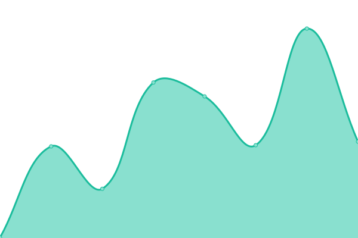

# [📈 Live Status](https://status.tacxtv.fr): <!--live status--> **🟧 Partial outage**

This repository contains the open-source uptime monitor and status page for [TacxTV](tacxtv.fr), powered by [Upptime](https://github.com/upptime/upptime).

With [Upptime](https://upptime.js.org), you can get your own unlimited and free uptime monitor and status page, powered entirely by a GitHub repository. We use [Issues](https://github.com/tacxtv/fr.tacxtv.status/issues) as incident reports, [Actions](https://github.com/tacxtv/fr.tacxtv.status/actions) as uptime monitors, and [Pages](https://status.tacxtv.fr) for the status page.

<!--start: status pages-->
<!-- This summary is generated by Upptime (https://github.com/upptime/upptime) -->
<!-- Do not edit this manually, your changes will be overwritten -->
<!-- prettier-ignore -->
| URL | Status | History | Response Time | Uptime |
| --- | ------ | ------- | ------------- | ------ |
|  [gateway.tacxtv.fr](gateway.tacxtv.fr) | 🟥 Down | [gateway-tacxtv-fr.yml](https://github.com/tacxtv/fr.tacxtv.status/commits/HEAD/history/gateway-tacxtv-fr.yml) | 

 1236ms
     
 | 

<a href="https://status.tacxtv.fr/history/gateway-tacxtv-fr">99.91%</a>
    

|  [tacxtv.fr](https://tacxtv.fr) | 🟩 Up | [tacxtv-fr.yml](https://github.com/tacxtv/fr.tacxtv.status/commits/HEAD/history/tacxtv-fr.yml) | 

 333ms
     
 | 

<a href="https://status.tacxtv.fr/history/tacxtv-fr">100.00%</a>
    

|  [eco.tacxtv.fr](https://eco.tacxtv.fr/) | 🟩 Up | [eco-tacxtv-fr.yml](https://github.com/tacxtv/fr.tacxtv.status/commits/HEAD/history/eco-tacxtv-fr.yml) | 

 929ms
     
 | 

<a href="https://status.tacxtv.fr/history/eco-tacxtv-fr">100.00%</a>
    

|  [eco.tacxtv.fr (game)](eco.tacxtv.fr) | 🟥 Down | [eco-tacxtv-fr-game.yml](https://github.com/tacxtv/fr.tacxtv.status/commits/HEAD/history/eco-tacxtv-fr-game.yml) | 

 0ms
     
 | 

<a href="https://status.tacxtv.fr/history/eco-tacxtv-fr-game">98.04%</a>
    

|  [miratopia.tacxtv.fr](https://miratopia.tacxtv.fr) | 🟩 Up | [miratopia-tacxtv-fr.yml](https://github.com/tacxtv/fr.tacxtv.status/commits/HEAD/history/miratopia-tacxtv-fr.yml) | 

 310ms
     
 | 

<a href="https://status.tacxtv.fr/history/miratopia-tacxtv-fr">100.00%</a>
    

<!--end: status pages-->

[**Visit our status website →**](https://status.tacxtv.fr)

## 📄 License

- Powered by: [Upptime](https://github.com/upptime/upptime)
- Code: [MIT](./LICENSE) © [TacxTV](tacxtv.fr)
- Data in the `./history` directory: [Open Database License](https://opendatacommons.org/licenses/odbl/1-0/)
